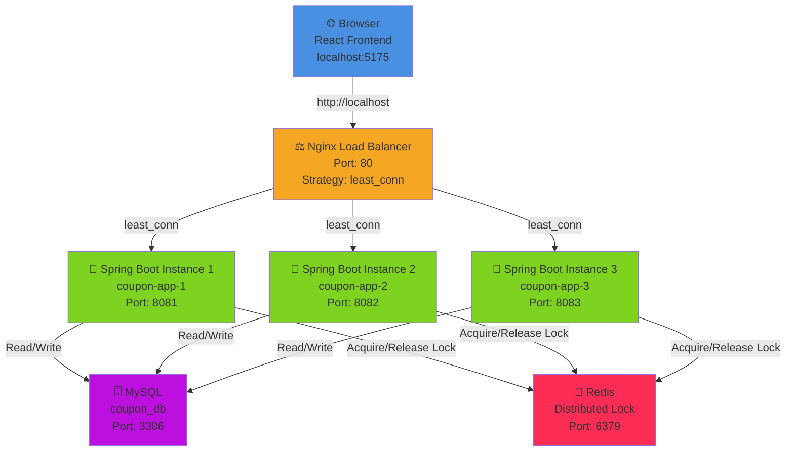
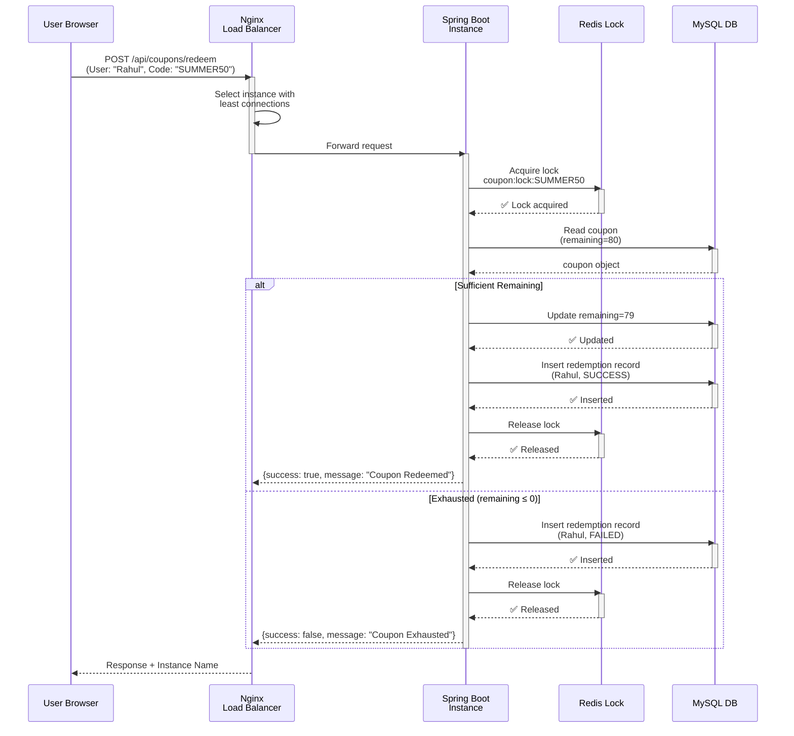
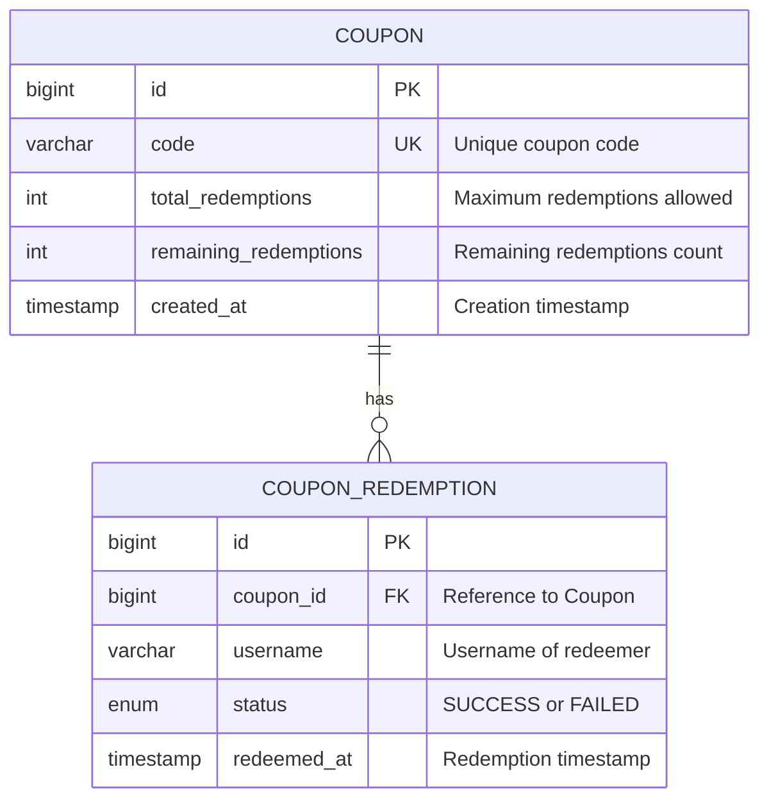
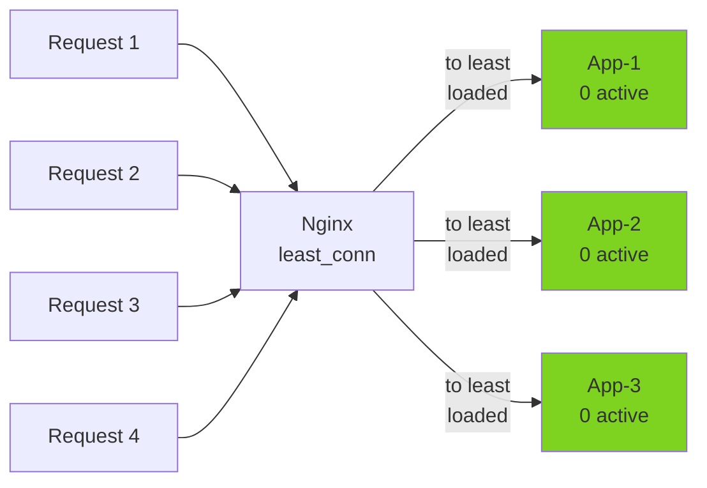

# Coupon Redemption System - Distributed Locking with Redis

> **A production-grade microservices demo showcasing distributed locking patterns to prevent race conditions in high-concurrency e-commerce scenarios.**

---

## Overview

This project demonstrates how **distributed locking** solves race condition problems in multi-instance deployments. It's a practical learning tool for understanding:

- **Race Conditions**: What happens when multiple instances compete for the same resource
- **Distributed Locks**: How Redis prevents concurrent access violations
- **Load Balancing**: How Nginx routes requests across multiple instances
- **System Resilience**: Handling failures while maintaining data consistency

### Real-World Scenario

Imagine a flash sale with a limited-time coupon code offering only **100 redemptions**. When 1000 users simultaneously attempt to redeem it:

**Without Locking (Race Condition):**
```
Instance-1 reads: 100 → decrements to 99 → saves
Instance-2 reads: 100 → decrements to 99 → saves (overwrites Instance-1!)
Instance-3 reads: 100 → decrements to 99 → saves (overwrites Instance-2!)
Result: 200+ users redeemed a 100-unit coupon ❌ Business loss!
```

**With Distributed Locking:**
```
Instance-1 acquires lock → reads 100 → decrements to 99 → saves → releases lock
Instance-2 waits for lock...
Instance-3 waits for lock...
Instance-2 acquires lock → reads 99 → decrements to 98 → saves → releases lock
...continues until 0 remaining
Result: Exactly 100 users redeemed ✅ Consistent state!
```

---

## System Architecture

### High-Level Deployment Diagram



### Request Flow for Coupon Redemption



---

## Technology Stack

| Component | Technology | Purpose |
|-----------|-----------|---------|
| **Backend** | Spring Boot 4 | REST APIs, Business Logic |
| | Spring Data JPA | ORM & Database Access |
| | MySQL 8 | Persistent Storage |
| | Redis 7 | Distributed Lock & Cache |
| | Gradle 9.5 | Build Tool |
| | JDK 26 | Runtime |
| **Frontend** | React 19 | UI Framework |
| | Material UI (MUI) | Component Library |
| | Vite | Build Tool |
| **Infrastructure** | Nginx (Alpine) | Load Balancer |
| | Docker | Containerization |
| | Docker Compose | Orchestration |

---

## Data Model

### Entity Relationship Diagram



### Database Schema

**COUPON Table:**
```sql
CREATE TABLE coupon (
    id BIGINT PRIMARY KEY AUTO_INCREMENT,
    code VARCHAR(100) UNIQUE NOT NULL,
    total_redemptions INT NOT NULL,
    remaining_redemptions INT NOT NULL,
    created_at TIMESTAMP DEFAULT CURRENT_TIMESTAMP
);
```

**COUPON_REDEMPTION Table:**
```sql
CREATE TABLE coupon_redemption (
    id BIGINT PRIMARY KEY AUTO_INCREMENT,
    coupon_id BIGINT NOT NULL,
    username VARCHAR(100) NOT NULL,
    status ENUM('SUCCESS', 'FAILED') NOT NULL,
    redeemed_at TIMESTAMP DEFAULT CURRENT_TIMESTAMP,
    FOREIGN KEY (coupon_id) REFERENCES coupon(id)
);
```

---

## API Contracts

### 1. Create Coupon

**Endpoint:** `POST /api/coupons`

**Request:**
```json
{
  "code": "SUMMER50",
  "totalRedemptions": 100
}
```

**Response (201 Created):**
```json
{
  "id": 1,
  "code": "SUMMER50",
  "remainingRedemptions": 100
}
```

**Errors:**
- `400 Bad Request` - Invalid code or totalRedemptions
- `409 Conflict` - Coupon code already exists

---

### 2. List Coupons (Paginated)

**Endpoint:** `GET /api/coupons?page=0&size=5`

**Query Parameters:**
- `page` (int, default: 0) - Page number (0-indexed)
- `size` (int, default: 5) - Items per page

**Response (200 OK):**
```json
{
  "content": [
    {
      "id": 1,
      "code": "SUMMER50",
      "totalRedemptions": 100,
      "remainingRedemptions": 80,
      "createdAt": "2026-07-04T10:00:00Z"
    },
    {
      "id": 2,
      "code": "WELCOME10",
      "totalRedemptions": 50,
      "remainingRedemptions": 45,
      "createdAt": "2026-07-04T11:00:00Z"
    }
  ],
  "page": 0,
  "size": 5,
  "totalPages": 4,
  "totalElements": 20
}
```

---

### 3. Redeem Coupon

**Endpoint:** `POST /api/coupons/redeem`

**Request:**
```json
{
  "couponCode": "SUMMER50",
  "username": "Rahul"
}
```

**Response - Success (200 OK):**
```json
{
  "success": true,
  "message": "Coupon Redeemed",
  "instanceName": "coupon-app-1"
}
```

**Response - Failure (200 OK):**
```json
{
  "success": false,
  "message": "Coupon Exhausted",
  "instanceName": "coupon-app-2"
}
```

**Possible Messages:**
- `Coupon Redeemed` - Successfully redeemed
- `Coupon Exhausted` - No remaining redemptions
- `Coupon Not Found` - Invalid coupon code
- `Coupon is busy, please retry.` - Lock acquisition timeout

**Errors:**
- `400 Bad Request` - Missing couponCode or username
- `503 Service Unavailable` - System overloaded

---

### 4. Get Redemption History

**Endpoint:** `GET /api/coupons/{couponId}/redemptions?page=0&size=5`

**Path Parameters:**
- `couponId` (long) - ID of the coupon

**Query Parameters:**
- `page` (int, default: 0) - Page number (0-indexed)
- `size` (int, default: 5) - Items per page

**Response (200 OK):**
```json
{
  "content": [
    {
      "username": "Rahul",
      "couponCode": "SUMMER50",
      "status": "SUCCESS",
      "redeemedAt": "2026-07-04T12:36:00Z"
    },
    {
      "username": "Priya",
      "couponCode": "SUMMER50",
      "status": "SUCCESS",
      "redeemedAt": "2026-07-04T12:36:01Z"
    },
    {
      "username": "Deepak",
      "couponCode": "SUMMER50",
      "status": "FAILED",
      "redeemedAt": "2026-07-04T12:36:02Z"
    }
  ],
  "page": 0,
  "size": 5,
  "totalPages": 20,
  "totalElements": 100
}
```

**Errors:**
- `404 Not Found` - Coupon not found

---

## Project Structure

```
coupon-redemption-system/
├── coupon-service/              # Spring Boot Backend
│   ├── src/main/java/
│   │   └── in/codefarm/coupon/service/
│   │       ├── controller/      # REST Controllers
│   │       ├── service/         # Business Logic
│   │       ├── entity/          # JPA Entities
│   │       ├── repository/      # Data Access Layer
│   │       ├── lock/            # Lock Strategy Pattern
│   │       ├── config/          # Spring Configuration
│   │       ├── dto/             # Data Transfer Objects
│   │       └── exception/       # Custom Exceptions
│   ├── Dockerfile              # Multi-stage build (Gradle + JDK 26)
│   ├── build.gradle            # Gradle dependencies
│   └── README.md               # Backend documentation
│
├── frontend-react/              # React UI
│   ├── src/
│   │   ├── components/         # React Components
│   │   ├── api/                # API Client
│   │   ├── utils/              # Utility Functions
│   │   └── assets/             # Static Assets
│   ├── vite.config.js
│   ├── package.json
│   └── README.md               # Frontend documentation
│
├── nginx/                       # Load Balancer Config
│   ├── nginx.conf              # Nginx configuration with least_conn
│   ├── Dockerfile              # Nginx container
│   └── README.md               # Nginx documentation
│
├── mysql-init/                 # Database Initialization
│   └── init.sql               # Schema creation scripts
│
├── docker-compose.yml          # Orchestration
│   # Services defined:
│   # - mysql:8.0
│   # - redis:7-alpine
│   # - coupon-app-1, coupon-app-2, coupon-app-3
│   # - nginx
│
└── README.md                   # This file
```

---

## Quick Start

### Prerequisites

- Docker & Docker Compose installed
- Node.js 18+ (for local frontend development)
- Git

### Option 1: Run with Docker Compose (Recommended)

**Step 1: Clone and navigate**
```bash
cd coupon-redemption-system
```

**Step 2: Start all services**
```bash
docker-compose up --build -d
```

This will start:
- ✅ MySQL (Port 3306)
- ✅ Redis (Port 6379)
- ✅ 3 Spring Boot instances (Ports 8081, 8082, 8083)
- ✅ Nginx Load Balancer (Port 80)

**Step 3: Access the application**
- Frontend: `http://localhost:5175` (after starting React dev server)
- API (via Nginx): `http://localhost/api/coupons`
- Direct instances: `http://localhost:8081/api/coupons`

---

## Documentation

### Subdirectory Guides

| Component | Documentation |
|-----------|---|
| **Backend** | [coupon-service/README.md](coupon-service/README.md) - Spring Boot setup, lock strategies, configuration |
| **Frontend** | [frontend-react/README.md](frontend-react/README.md) - React components, API client, UI features |
| **Load Balancer** | [nginx/README.md](nginx/README.md) - Nginx configuration, routing strategy, monitoring |

---

## Learning: Race Condition vs. Distributed Locking

### Scenario: Redeem 100 coupons with 80 available

**Without Lock (`coupon.lock.enabled=false`):**

**Without Lock (`coupon.lock.enabled=false`):**

```
Expected: 80 SUCCESS, 20 FAILED
Actual Results (Multiple runs):
├── Run 1: 5 SUCCESS, 95 FAILED    ❌ Inconsistent!
├── Run 2: 42 SUCCESS, 58 FAILED   ❌ Inconsistent!
├── Run 3: 78 SUCCESS, 22 FAILED   ❌ Inconsistent!
└── Run 4: 12 SUCCESS, 88 FAILED   ❌ Inconsistent!

Why? Race conditions at work:
- All 3 instances read remaining=80 simultaneously
- All decrement and save 79 (overwriting each other)
- Only the last write persists, losing 79 potential redemptions
```

**With Lock (`coupon.lock.enabled=true`):**

```
Expected: 80 SUCCESS, 20 FAILED
Actual Results (Multiple runs):
├── Run 1: 80 SUCCESS, 20 FAILED   ✅ Perfect!
├── Run 2: 80 SUCCESS, 20 FAILED   ✅ Perfect!
├── Run 3: 80 SUCCESS, 20 FAILED   ✅ Perfect!
└── Run 4: 80 SUCCESS, 20 FAILED   ✅ Perfect!

Why? Distributed locking at work:
- Instance-1 acquires lock → processes request 1
- Instance-2 waits for lock...
- Instance-3 waits for lock...
- Only after release does next instance proceed
- Exact consistency maintained!
```

---

## How Distributed Locking Works

### Lock Strategy Pattern

Your application uses a **Strategy Pattern** for flexible lock implementation:

```mermaid
graph TD
    Service["CouponRedemptionService"]
    Interface["LockStrategy<br/>Interface"]
    NoLock["NoLockStrategy<br/>Do nothing"]
    RedisLock["RedisLockStrategy<br/>Use Redis"]
    
    Service -->|depends on| Interface
    Interface --|implemented by| NoLock
    Interface --|implemented by| RedisLock
    
    Config["application.properties<br/>coupon.lock.enabled"]
    Config -->|if true| RedisLock
    Config -->|if false| NoLock
```

### Lock Acquisition with Exponential Backoff

When a request arrives to redeem a coupon:

```
Request arrives (User: "Rahul", Coupon: "SUMMER50")
    ↓
Try to acquire lock
    ├─ Attempt 1: Try immediately → FAIL (locked by other request)
    ├─ Wait 50ms
    ├─ Attempt 2: Try again → FAIL
    ├─ Wait 100ms (doubled)
    ├─ Attempt 3: Try again → FAIL
    ├─ Wait 200ms (doubled)
    ├─ Attempt 4: Try again → FAIL
    ├─ Wait 400ms (doubled)
    ├─ Attempt 5: Try again → SUCCESS! ✅
    ├─ Process redemption
    └─ Release lock
    
Logs show:
[LOCK ACQUIRED] User: Rahul, Coupon: SUMMER50, Attempt: 5/10, Instance: coupon-app-1
[COUPON REDEEMED] User: Rahul, Coupon: SUMMER50, Remaining: 79, Instance: coupon-app-1
[LOCK RELEASED] User: Rahul, Coupon: SUMMER50, Instance: coupon-app-1
```

---

## Load Balancing with Nginx

### Least Connections Strategy

Nginx routes requests to the instance with the **fewest active connections**:



**Advantages:**
- ✅ Automatically balances load in real-time
- ✅ Adapts to varying request durations
- ✅ Prevents overloading a single instance
- ✅ Better than round-robin for heterogeneous workloads

**Monitor in Logs:**
```bash
docker logs coupon-nginx -f | grep upstream
# Output shows which instance served each request:
# upstream: 172.18.0.4:8080  (app-1)
# upstream: 172.18.0.5:8080  (app-2)
# upstream: 172.18.0.6:8080  (app-3)
```

---

## Key Features

### ✅ Implemented

- [x] Multi-instance deployment with load balancing
- [x] Distributed locking with Redis using exponential backoff retry
- [x] Coupon CRUD operations with pagination
- [x] Batch redemption simulation (10, 100, 1000 users)
- [x] Redemption history tracking with pagination
- [x] Configurable lock toggle (no code changes needed)
- [x] Real-time UI with Material Design
- [x] Detailed logging for debugging and observation
- [x] Docker Compose orchestration with health checks
- [x] Postman collection for API testing

### 🎓 Learning Outcomes

By working through this project, you'll understand:

1. **Race Conditions** - How they occur in distributed systems
2. **Distributed Locks** - Using Redis as a coordination mechanism
3. **Lock Strategies** - Retry logic and exponential backoff
4. **Load Balancing** - How Nginx distributes requests (least_conn)
5. **Microservices Architecture** - Multi-tier distributed systems
6. **Spring Boot** - Building production-grade REST APIs
7. **Data Consistency** - Maintaining integrity under concurrency
8. **Docker** - Containerization and orchestration
9. **System Design** - Scalable and resilient architectures
10. **Testing Distributed Systems** - Observing behavior with and without locks

---

## Monitoring & Debugging

### View All Logs

```bash
# All services
docker-compose logs -f

# Specific service
docker-compose logs -f coupon-app-1
docker-compose logs -f coupon-app-2
docker-compose logs -f coupon-app-3
docker-compose logs -f nginx
docker-compose logs -f redis
docker-compose logs -f mysql
```

### View Nginx Routing

```bash
docker logs coupon-nginx -f | grep upstream
```

### Check Lock Activity

```bash
docker logs coupon-app-1 -f | grep "LOCK"
# Shows:
# [LOCK ACQUIRED] User: Rahul, Coupon: SUMMER50, ...
# [LOCK RETRY] User: Priya, Coupon: SUMMER50, ...
# [LOCK FAILED] User: Deepak, Coupon: SUMMER50, ...
```

### Direct Database Query

```bash
# Access MySQL
docker exec -it coupon-mysql mysql -u coupon_user -p coupon_db
# Password: coupon_pass

# View remaining count
SELECT code, total_redemptions, remaining_redemptions FROM coupon;

# View redemption history
SELECT username, status, redeemed_at FROM coupon_redemption ORDER BY redeemed_at DESC LIMIT 20;
```

### Direct Redis Query

```bash
# Access Redis
docker exec -it coupon-redis redis-cli

# List all locks (if any are held)
KEYS coupon:lock:*

# Check specific lock
GET coupon:lock:SUMMER50
```

---

## Cleanup

```bash
# Stop all services
docker-compose down

# Remove volumes (clean database)
docker-compose down -v

# Remove images and rebuild
docker-compose down --rmi all
docker-compose up --build -d
```

---

## Postman Collection

A Postman collection is included for API testing:

**File:** `coupon-service.postman_collection.json`

**To use:**
1. Import into Postman
2. Set base URL variable: `http://localhost/api`
3. Test endpoints (Create, List, Redeem, History)

---

## Production Considerations

### Security

- [ ] Add authentication (JWT/OAuth)
- [ ] Add authorization (role-based access)
- [ ] Enable HTTPS/TLS
- [ ] Add rate limiting
- [ ] Input validation and sanitization

### Resilience

- [ ] Circuit breaker pattern for Redis
- [ ] Fallback strategies if Redis unavailable
- [ ] Connection pooling optimization
- [ ] Timeout configurations
- [ ] Retry policies with jitter

### Monitoring

- [ ] Application metrics (Micrometer/Prometheus)
- [ ] Distributed tracing (Jaeger/Zipkin)
- [ ] Health checks and alerts
- [ ] Log aggregation (ELK/Loki)
- [ ] Performance profiling

### Performance

- [ ] Database indexing on coupon_code
- [ ] Connection pool tuning
- [ ] Cache layer for frequently accessed coupons
- [ ] Batch operations for bulk redemptions
- [ ] CDN for static assets

---

## Architecture Decisions

| Decision | Rationale |
|----------|-----------|
| **Strategy Pattern for Locks** | Allow flexible swap between implementations (NoLock, RedisLock) without code changes |
| **Exponential Backoff Retry** | Reduces thundering herd, allows fair lock distribution |
| **Least Connections Load Balancing** | Better than round-robin for variable request durations |
| **Docker Compose** | Single command orchestration for learning/demo purposes |
| **Material UI** | Professional, accessible components out of the box |
| **Pagination on All Endpoints** | Prevents N+1 queries, improves frontend performance |
| **Instance Names in Response** | Makes load distribution visible to understand system behavior |

---

## Troubleshooting

### Issue: "Could not acquire lock" errors even with lock enabled

**Cause:** Lock acquisition timeout (retry logic exhausted)

**Solution:**
- Increase `MAX_LOCK_RETRIES` in `CouponRedemptionService`
- Reduce number of concurrent requests
- Check Redis connectivity: `docker exec coupon-redis redis-cli ping`

### Issue: Inconsistent coupon counts with lock enabled

**Cause:** Lock implementation issue or stale Redis data

**Solution:**
```bash
# Clear Redis locks
docker exec coupon-redis redis-cli FLUSHALL

# Restart services
docker-compose restart
```

### Issue: Requests not distributed evenly across instances

**Cause:** `least_conn` routes to least-connected, not round-robin

**Solution:**
- This is expected! Requests distribute based on active connections
- If uneven, check if instances have different response times
- Verify all 3 instances are healthy: `docker-compose ps`

### Issue: Frontend can't connect to backend

**Cause:** CORS or network issues

**Solution:**
```bash
# Check if Nginx is running
docker-compose ps nginx

# Test Nginx
curl http://localhost/health

# Check backend connectivity
curl http://localhost:8081/actuator/health
```

---

## References & Further Reading

- [Redis Distributed Locks](https://redis.io/commands/set/#options) - SET with NX option
- [Spring Data Redis](https://spring.io/projects/spring-data-redis)
- [Nginx Load Balancing](https://nginx.org/en/docs/http/load_balancing.html)
- [Race Conditions & Concurrency](https://en.wikipedia.org/wiki/Race_condition)
- [Docker Best Practices](https://docs.docker.com/develop/dev-best-practices/)

---

## Contributing

This is an educational project. Contributions for improvements are welcome:
- Better documentation
- Additional lock strategies
- Performance optimizations
- Security enhancements
- Additional test scenarios

---

## License

This project is provided as-is for learning purposes.

---

## Support

For issues, questions, or feedback:
1. Check the [troubleshooting section](#troubleshooting)
2. Review logs: `docker-compose logs`
3. Consult subdirectory READMEs for component-specific help

---

**Happy learning! Watch the race condition in action and see how distributed locking solves it.** 🚀
