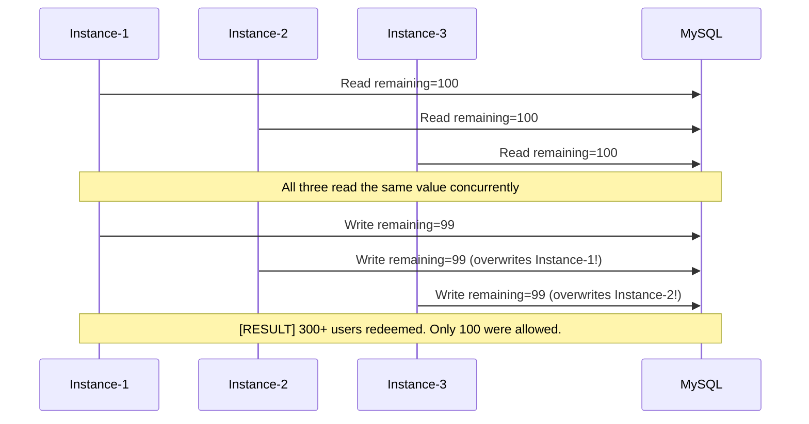
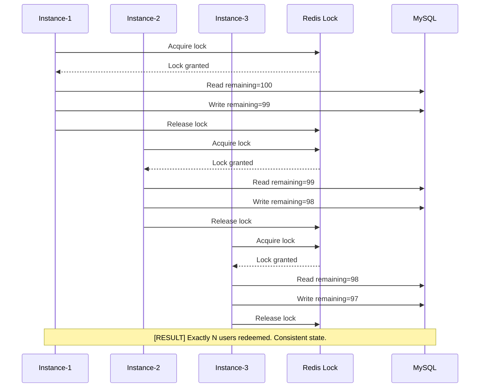
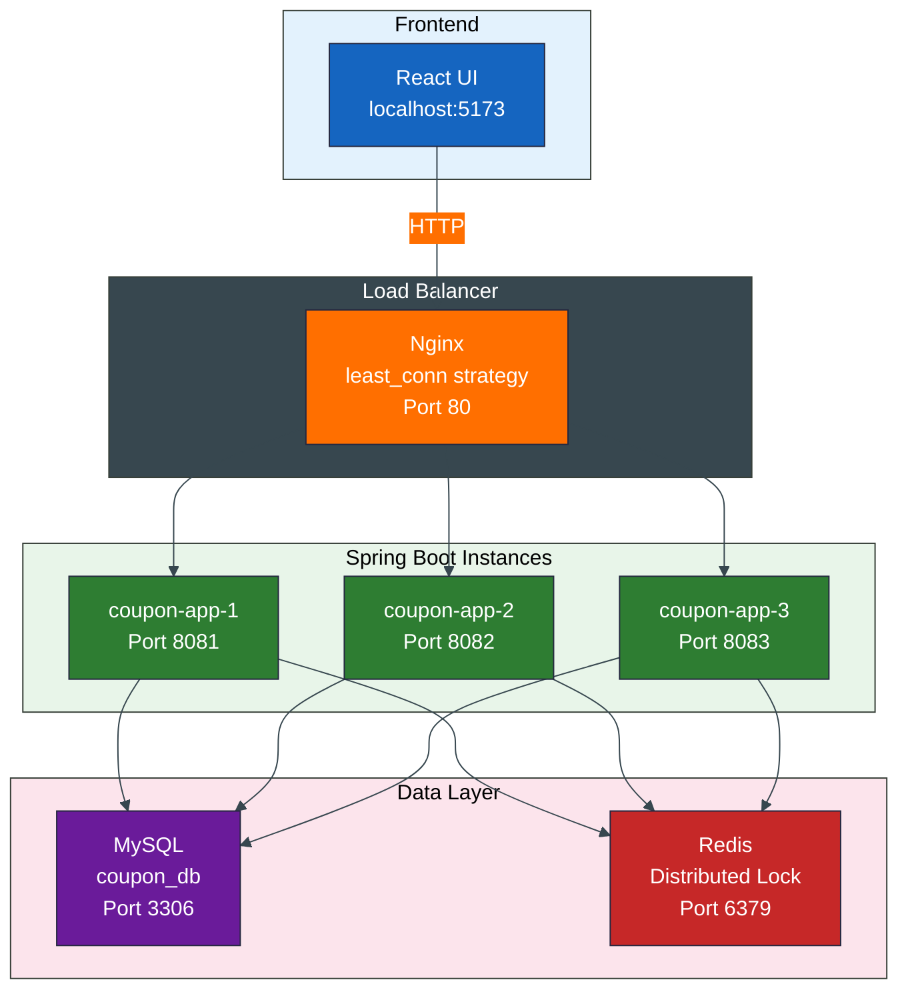
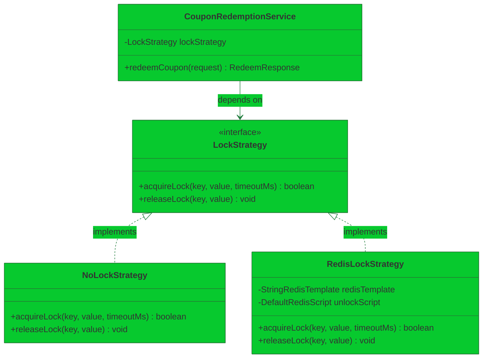
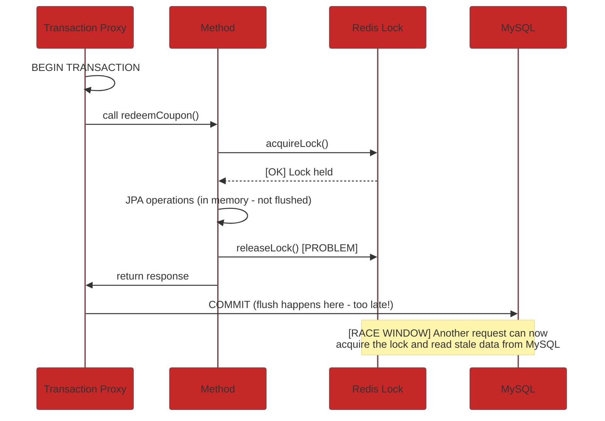
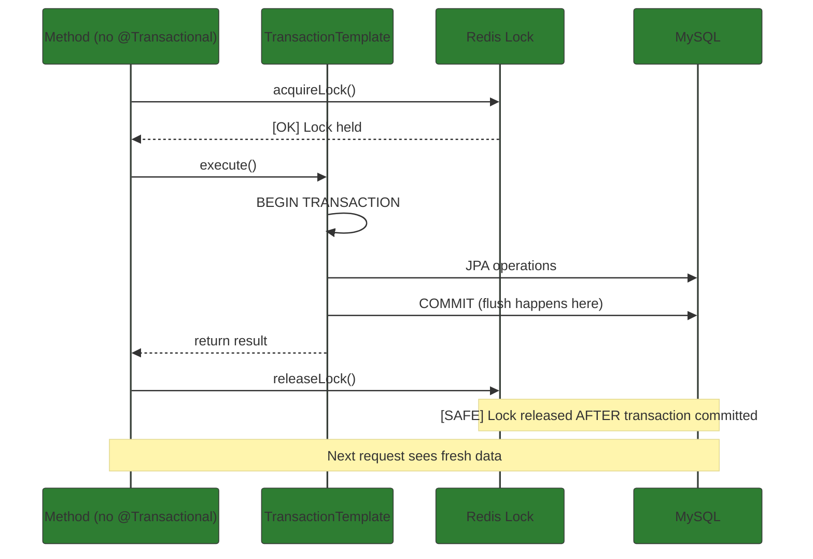

# Distributed Coupon Redemption System -- Architecture of a Race Condition Proof Microservice

> **How to build a high-concurrency coupon redemption system with Spring Boot, Redis distributed locking, Nginx load balancing, and React -- and watch the race condition disappear when you flip a config flag.**

---

**Meta Description:** Learn how to build a production-grade distributed coupon redemption system using Spring Boot microservices, Redis distributed locks, Nginx load balancing, and React. Complete architecture deep dive with code, diagrams, and real race condition debugging.

---

**Target Keywords:** distributed coupon redemption system, Redis distributed locking, Spring Boot microservices, race condition prevention, high-concurrency coupon system, Nginx load balancing microservices, distributed lock strategy pattern, coupon redemption architecture

---

## The Problem: 100 Coupons, 1000 Users, Zero Coordination

Imagine a flash sale. A coupon code `SUMMER50` has exactly **100 redemptions**. One thousand users click "Claim" simultaneously. Your system has three application instances running behind a load balancer. What happens?

**Without distributed locking -- the race condition:**



This is a **race condition** -- multiple instances read and write the same shared state without coordination. The result: **overselling, negative inventory, inconsistent database state, and real business losses.**

**With distributed locking -- coordinated access:**



This project demonstrates both scenarios side by side -- with a single config toggle to switch between them. **Zero code changes.**

---

## System Architecture Overview



### Component Responsibilities

| Component | Role |
|-----------|------|
| **React + MUI** | Coupon list with pagination, claim simulation (1/10/100/1000 users), redemption history |
| **Nginx** | Routes requests to the least-loaded Spring Boot instance |
| **Spring Boot** | REST APIs, coupon CRUD, redemption logic, distributed lock integration |
| **MySQL** | Persistent storage for coupons and redemption history |
| **Redis** | Distributed lock coordination across all instances |

---

## The Lock Strategy Pattern -- No Code Changes Needed

The project's most important design decision: **the lock is pluggable**.



```java
public interface LockStrategy {
    boolean acquireLock(String key, String value, long timeoutMs);
    void releaseLock(String key, String value);
}
```

### NoLockStrategy (Race Condition Mode)

```java
public class NoLockStrategy implements LockStrategy {
    @Override
    public boolean acquireLock(String key, String value, long timeoutMs) {
        return true;
    }
    @Override
    public void releaseLock(String key, String value) {
        // No-op
    }
}
```

Every request passes through without waiting. **Race conditions guaranteed.**

### RedisLockStrategy (Safe Mode)

```java
public class RedisLockStrategy implements LockStrategy {
    @Override
    public boolean acquireLock(String key, String value, long timeoutMs) {
        Boolean acquired = redisTemplate.opsForValue()
                .setIfAbsent(key, value, Duration.ofMillis(timeoutMs));
        return Boolean.TRUE.equals(acquired);
    }

    @Override
    public void releaseLock(String key, String value) {
        redisTemplate.execute(unlockScript, List.of(key), value);
    }
}
```

Uses Redis `SET NX` (set if not exists) with a TTL to create a lease.

### Configuration-Driven Selection

```java
@Configuration
public class LockConfig {

    @Bean
    @ConditionalOnProperty(name = "coupon.lock.enabled", havingValue = "true", matchIfMissing = true)
    public LockStrategy redisLockStrategy(StringRedisTemplate redisTemplate) {
        return new RedisLockStrategy(redisTemplate);
    }

    @Bean
    @ConditionalOnProperty(name = "coupon.lock.enabled", havingValue = "false")
    public LockStrategy noLockStrategy() {
        return new NoLockStrategy();
    }
}
```

Set `coupon.lock.enabled=true` or `coupon.lock.enabled=false` in `application.yaml`. **That's it. No code changes.**

---

## The Critical Bug We Found (And Fixed)

During development, we discovered a subtle but devastating bug: **the Redis lock was being released before the database transaction committed.**



### The Fix: Lock Outside the Transaction



```java
// FIXED: Lock acquired before transaction, released after
public RedeemResponse redeemCoupon(RedeemRequest request) {
    boolean acquired = acquireLockWithRetry(lockKey, lockValue, ...);
    if (!acquired) return RedeemResponse.failure("Busy", instanceName);

    try {
        return transactionTemplate.execute(status -> {
            Coupon coupon = couponRepository.findByCode(request.couponCode()).orElse(null);
            if (coupon == null) return RedeemResponse.failure("Not Found", instanceName);
            if (coupon.getRemainingRedemptions() <= 0) {
                redemptionRepository.save(new CouponRedemption(coupon.getId(), request.username(), RedemptionStatus.FAILED));
                return RedeemResponse.failure("Coupon Exhausted", instanceName);
            }
            coupon.setRemainingRedemptions(coupon.getRemainingRedemptions() - 1);
            redemptionRepository.save(new CouponRedemption(coupon.getId(), request.username(), RedemptionStatus.SUCCESS));
            return RedeemResponse.success("Coupon Redeemed", instanceName);
        });
    } finally {
        lockStrategy.releaseLock(lockKey, lockValue);
    }
}
```

Fixed order:
1. [OK] Lock acquired (Redis)
2. [OK] Transaction begins (MySQL connection)
3. [OK] JPA operations
4. [OK] Transaction commits (flush to MySQL)
5. [OK] Lock released -- next request sees fresh data
6. [OK] No race condition

---

## REST API Contract

| Method | Endpoint | Description |
|--------|----------|-------------|
| `POST` | `/api/coupons` | Create a new coupon |
| `GET` | `/api/coupons?page=0&size=5` | List coupons (paginated) |
| `POST` | `/api/coupons/redeem` | Redeem a coupon |
| `GET` | `/api/coupons/{id}/redemptions?page=0&size=5` | Redemption history |

### Example: Redeem a Coupon

```bash
curl -X POST http://localhost/api/coupons/redeem \
  -H "Content-Type: application/json" \
  -d '{"couponCode": "SUMMER50", "username": "Rahul"}'
```

**Success response:**
```json
{
  "success": true,
  "message": "Coupon Redeemed",
  "instanceName": "coupon-app-2"
}
```

**Exhausted response:**
```json
{
  "success": false,
  "message": "Coupon Exhausted",
  "instanceName": "coupon-app-1"
}
```

---

## Running the Demo

```bash
docker compose up --build -d
curl http://localhost/health
curl -X POST http://localhost/api/coupons \
  -H "Content-Type: application/json" \
  -d '{"code": "SUMMER50", "totalRedemptions": 100}'
cd frontend-react && npm install && npm run dev
```

Open `http://localhost:5173`, click **Claim x100**, and watch the real-time results.

---

## What's Next -- Deep Dives

This article covered the high-level architecture. Each component has its own deep dive:

| Story | Topic | What You'll Learn |
|-------|-------|-------------------|
| [**Story 2**](2-spring-boot-concepts-distributed-locking.md) | Spring Boot | REST APIs, JPA entities, @Transactional, Strategy Pattern, @ConditionalOnProperty, global error handling |
| [**Story 3**](3-nginx-load-balancing-microservices.md) | Nginx | least_conn load balancing, upstream configuration, custom logging, health checks |
| [**Story 4**](4-react-material-ui-coupon-dashboard.md) | React + MUI | Component architecture, Promise.allSettled for concurrent simulation, mock API pattern, pagination |
| [**Story 5**](5-redis-distributed-lock-commands-patterns.md) | Redis | SET NX lock, Lua unlock script, exponential backoff, monitoring commands |
| [**Story 6**](6-docker-compose-microservices-orchestration.md) | Docker | Multi-stage Dockerfile, Compose orchestration, health checks, networking, environment configuration |

---

## Key Takeaways

1. **Race conditions in distributed systems are real** -- they happen when multiple instances share state without coordination
2. **Redis distributed locking is the fix** -- `SET NX` with TTL and a Lua unlock script provides safe coordination
3. **Lock timing matters** -- releasing the lock before the transaction commits still allows races (we fixed this bug)
4. **The Strategy Pattern makes it configurable** -- switch between lock and no-lock with a single config property, zero code changes
5. **Docker Compose makes complex demos simple** -- 6 services, one command

---

## Source Code

The complete source code for this project is available on GitHub:

**[github.com/.../coupon-redemption-system](https://github.com/)**

Clone it, run `docker compose up`, and see the race condition disappear when you flip `coupon.lock.enabled=true`.

---

*Follow for more deep dives into distributed systems, Spring Boot, and production microservices patterns.*
