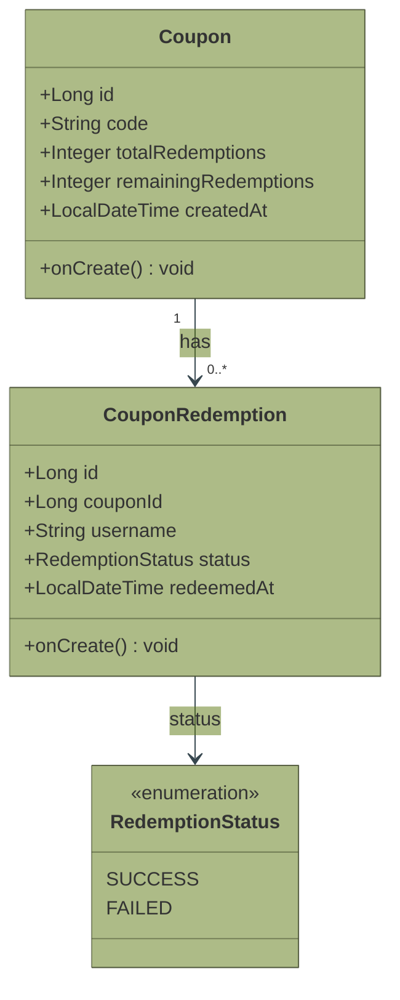
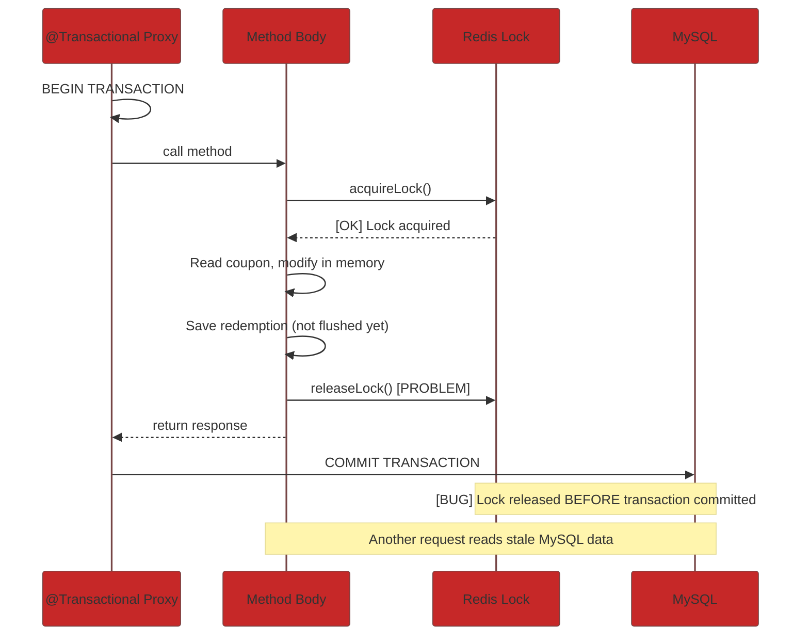
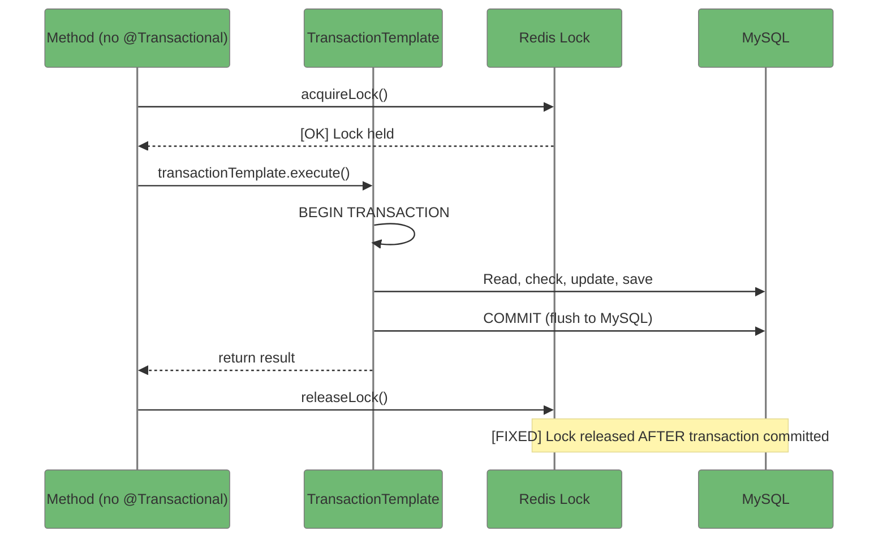

# Spring Boot Microservices -- 10 Concepts This Coupon Redemption System Teaches You

> **From JPA entities to distributed locking, transaction boundaries to strategy patterns -- every Spring Boot concept in the coupon redemption system, explained with production code.**

---

**Meta Description:** Master Spring Boot microservices with this practical coupon redemption system. Learn JPA entities, @Transactional, Strategy Pattern, @ConditionalOnProperty, global error handling, and distributed locking -- all with real production code.

---

**Target Keywords:** Spring Boot microservices, Spring Boot distributed locking, Spring Boot JPA entities, Spring Boot @Transactional, Spring Boot Strategy Pattern, Spring Boot @ConditionalOnProperty, Spring Boot REST API, Spring Boot error handling

---

## Introduction

The [coupon redemption system](1-distributed-coupon-redemption-architecture-overview.md) is built on **Spring Boot 4 with Java 26**, using Spring Data JPA for persistence, Redis for distributed locking, and a clean strategy pattern that makes the lock pluggable. This article walks through every Spring Boot concept the project demonstrates.

---

## Entity Relationship Diagram



---

## 1. REST Controllers -- Clean API Design

The `CouponController` exposes four endpoints using standard Spring MVC annotations:

```java
@RestController
@RequestMapping("/api/coupons")
public class CouponController {

    private final CouponRedemptionService couponService;

    public CouponController(CouponRedemptionService couponService) {
        this.couponService = couponService;
    }

    @PostMapping
    public ResponseEntity<CouponResponse> createCoupon(
            @RequestBody @Valid CreateCouponRequest request) {
        CouponResponse response = couponService.createCoupon(request);
        return ResponseEntity.status(HttpStatus.CREATED).body(response);
    }

    @GetMapping
    public ResponseEntity<Page<CouponResponse>> getCoupons(
            @RequestParam(defaultValue = "0") int page,
            @RequestParam(defaultValue = "5") int size) {
        return ResponseEntity.ok(couponService.getCoupons(page, size));
    }

    @PostMapping("/redeem")
    public ResponseEntity<RedeemResponse> redeemCoupon(
            @RequestBody @Valid RedeemRequest request) {
        return ResponseEntity.ok(couponService.redeemCoupon(request));
    }

    @GetMapping("/{couponId}/redemptions")
    public ResponseEntity<Page<RedemptionResponse>> getRedemptions(
            @PathVariable Long couponId,
            @RequestParam(defaultValue = "0") int page,
            @RequestParam(defaultValue = "5") int size) {
        return ResponseEntity.ok(couponService.getRedemptions(couponId, page, size));
    }
}
```

**Key patterns:**
- Constructor injection -- no `@Autowired`, cleaner testing
- `@Valid` on request bodies -- validation is declarative
- `ResponseEntity` for explicit HTTP status codes
- `Page<T>` return type -- Spring Data handles pagination serialization
- `@RequestParam` with sensible defaults

---

## 2. JPA Entities -- Database Mapping

```java
@Entity
@Table(name = "coupons")
public class Coupon {
    @Id
    @GeneratedValue(strategy = GenerationType.IDENTITY)
    private Long id;

    @Column(nullable = false, unique = true, length = 100)
    private String code;

    @Column(name = "total_redemptions", nullable = false)
    private Integer totalRedemptions;

    @Column(name = "remaining_redemptions", nullable = false)
    private Integer remainingRedemptions;

    @Column(name = "created_at", nullable = false, updatable = false)
    private LocalDateTime createdAt;

    @PrePersist
    protected void onCreate() {
        this.createdAt = LocalDateTime.now();
    }

    public Coupon(String code, Integer totalRedemptions) {
        this.code = code;
        this.totalRedemptions = totalRedemptions;
        this.remainingRedemptions = totalRedemptions;
    }
}
```

```java
@Entity
@Table(name = "coupon_redemptions")
public class CouponRedemption {
    @Id
    @GeneratedValue(strategy = GenerationType.IDENTITY)
    private Long id;

    @Column(name = "coupon_id", nullable = false)
    private Long couponId;

    @Column(nullable = false, length = 100)
    private String username;

    @Enumerated(EnumType.STRING)
    @Column(nullable = false)
    private RedemptionStatus status;

    @Column(name = "redeemed_at", nullable = false, updatable = false)
    private LocalDateTime redeemedAt;

    @PrePersist
    protected void onCreate() {
        this.redeemedAt = LocalDateTime.now();
    }
}
```

**Key patterns:**
- `@Enumerated(EnumType.STRING)` -- stores enum names, not ordinals (schema-friendly)
- `@PrePersist` -- automatic timestamp generation without database functions
- `@Column(name = "...")` -- explicit mapping to snake_case columns
- Java records for DTOs -- immutable, concise, Jackson-compatible

---

## 3. Spring Data JPA Repositories

```java
public interface CouponRepository extends JpaRepository<Coupon, Long> {
    Optional<Coupon> findByCode(String code);
    boolean existsByCode(String code);
}

public interface CouponRedemptionRepository extends JpaRepository<CouponRedemption, Long> {
    Page<CouponRedemption> findByCouponIdOrderByRedeemedAtDesc(
            Long couponId, Pageable pageable);
}
```

**Key patterns:**
- Query derivation from method names -- no SQL needed for common queries
- `Pageable` parameter -- handles pagination, sorting, and count queries
- `Optional<T>` return types -- explicit null handling

---

## 4. The @Transactional Bug We Fixed

This was the most important learning in the project. **The `@Transactional` annotation on the redemption method caused a lock-before-commit race condition.**

### The Problem



```java
// BAD: @Transactional wraps the entire method
@Transactional
public RedeemResponse redeemCoupon(RedeemRequest request) {
    acquireLock();
    // JPA operations (in memory - NOT flushed to MySQL)
    releaseLock();  // Lock released before commit!
}
```

### The Fix -- TransactionTemplate



```java
// FIXED: Lock outside transaction boundary
public RedeemResponse redeemCoupon(RedeemRequest request) {
    acquireLock();
    try {
        return transactionTemplate.execute(status -> {
            // read, check, decrement, save
            return RedeemResponse.success(...);
        });
    } finally {
        releaseLock();
    }
}
```

Read the full bug analysis in [Story 1: Architecture Overview](1-distributed-coupon-redemption-architecture-overview.md#the-critical-bug-we-found-and-fixed).

---

## 5. Strategy Pattern -- Pluggable Locking

```java
public interface LockStrategy {
    boolean acquireLock(String key, String value, long timeoutMs);
    void releaseLock(String key, String value);
}
```

| Implementation | Behavior | Use Case |
|----------------|----------|----------|
| `NoLockStrategy` | Always returns true, no-op release | Race condition demo (`coupon.lock.enabled=false`) |
| `RedisLockStrategy` | SET NX with TTL, Lua unlock | Production (`coupon.lock.enabled=true`) |

---

## 6. @ConditionalOnProperty -- Configuration-Driven Beans

```java
@Configuration
public class LockConfig {

    @Bean
    @ConditionalOnProperty(name = "coupon.lock.enabled",
            havingValue = "true", matchIfMissing = true)
    public LockStrategy redisLockStrategy(StringRedisTemplate redisTemplate) {
        return new RedisLockStrategy(redisTemplate);
    }

    @Bean
    @ConditionalOnProperty(name = "coupon.lock.enabled",
            havingValue = "false")
    public LockStrategy noLockStrategy() {
        return new NoLockStrategy();
    }
}
```

Spring Boot creates the correct `LockStrategy` at startup based on a single property. **No if/else in business logic, no feature flags, no runtime checks.**

---

## 7. Java Records for DTOs

All request and response DTOs are Java records:

```java
public record CreateCouponRequest(
        @NotBlank String code,
        @Min(1) int totalRedemptions
) {}

public record RedeemRequest(
        @NotBlank String couponCode,
        @NotBlank String username
) {}

public record CouponResponse(
        Long id,
        String code,
        Integer totalRedemptions,
        Integer remainingRedemptions,
        LocalDateTime createdAt
) {
    public static CouponResponse from(Coupon coupon) { ... }
}
```

**Why records?** No boilerplate (no getters, setters, equals, hashCode, toString), validation annotations work natively, Jackson serializes fields automatically.

---

## 8. @RestControllerAdvice -- Global Error Handling

```java
@RestControllerAdvice
public class GlobalExceptionHandler {

    @ExceptionHandler(CouponNotFoundException.class)
    public ResponseEntity<Map<String, String>> handleNotFound(CouponNotFoundException ex) {
        return ResponseEntity.status(HttpStatus.NOT_FOUND)
                .body(Map.of("error", ex.getMessage()));
    }

    @ExceptionHandler(CouponAlreadyExistsException.class)
    public ResponseEntity<Map<String, String>> handleConflict(CouponAlreadyExistsException ex) {
        return ResponseEntity.status(HttpStatus.CONFLICT)
                .body(Map.of("error", ex.getMessage()));
    }

    @ExceptionHandler(MethodArgumentNotValidException.class)
    public ResponseEntity<Map<String, String>> handleValidation(
            MethodArgumentNotValidException ex) {
        String message = ex.getBindingResult().getFieldErrors().stream()
                .map(e -> e.getField() + ": " + e.getDefaultMessage())
                .reduce((a, b) -> a + "; " + b)
                .orElse("Validation failed");
        return ResponseEntity.badRequest().body(Map.of("error", message));
    }
}
```

**Key patterns:**
- Centralized error handling -- no try/catch in controllers
- Consistent error response format -- always `{"error": "message"}`
- Proper HTTP status codes -- 404, 409, 400

---

## 9. @Value -- Environment-Aware Configuration

```java
@Service
public class CouponRedemptionService {

    public CouponRedemptionService(
            ...,
            @Value("${coupon.instance.name:coupon-app-1}") String instanceName
    ) {
        this.instanceName = instanceName;
    }
}
```

Each Docker container sets its own `COUPON_INSTANCE_NAME`, and it appears in every API response. Users can see which instance processed their redemption -- making load balancing visible.

```json
{
  "success": true,
  "message": "Coupon Redeemed",
  "instanceName": "coupon-app-2"
}
```

---

## 10. Application.yaml -- Layered Configuration

```yaml
spring:
  datasource:
    url: jdbc:mysql://localhost:3306/coupon_db
    username: root
    password: root
  jpa:
    hibernate:
      ddl-auto: update
  data:
    redis:
      host: localhost
      port: 6379

coupon:
  lock:
    enabled: true
  instance:
    name: coupon-app-1

server:
  port: 8085

management:
  endpoints:
    web:
      exposure:
        include: health
```

In Docker, environment variables override these values (`SPRING_DATASOURCE_URL`, `COUPON_LOCK_ENABLED`, etc.) -- Spring Boot's **relaxed binding** maps `COUPON_INSTANCE_NAME` to `coupon.instance.name` automatically.

---

## Spring Boot Concepts Summary

| Concept | Where It's Used |
|---------|-----------------|
| `@RestController` | CouponController -- all REST endpoints |
| `@Entity`, `@Table`, `@Column` | Coupon, CouponRedemption -- database mapping |
| `@Enumerated` | RedemptionStatus -- enum serialization |
| `@PrePersist` | Timestamp generation without DB functions |
| `JpaRepository` | Data access with query derivation |
| `@Transactional` | Atomic coupon creation |
| `TransactionTemplate` | Manual transaction boundary for lock safety |
| `@ConditionalOnProperty` | Strategy pattern selection at startup |
| `@RestControllerAdvice` | Global error handling |
| `@Value` | Environment-aware configuration injection |
| Java Records | Immutable DTOs with built-in validation |
| `Page<T>` / `Pageable` | Server-side pagination |

---

## Conclusion

This coupon redemption system demonstrates **10+ Spring Boot concepts** in a cohesive, runnable project. From basic REST APIs to the nuanced interaction between distributed locks and database transactions, every pattern is production-ready and battle-tested.

The complete source code is on GitHub:

**[github.com/.../coupon-redemption-system](https://github.com/)**

---

*For the full architecture overview including the Redis lock implementation, Nginx load balancing, and React frontend, read [Story 1: Architecture Overview](1-distributed-coupon-redemption-architecture-overview.md).*
